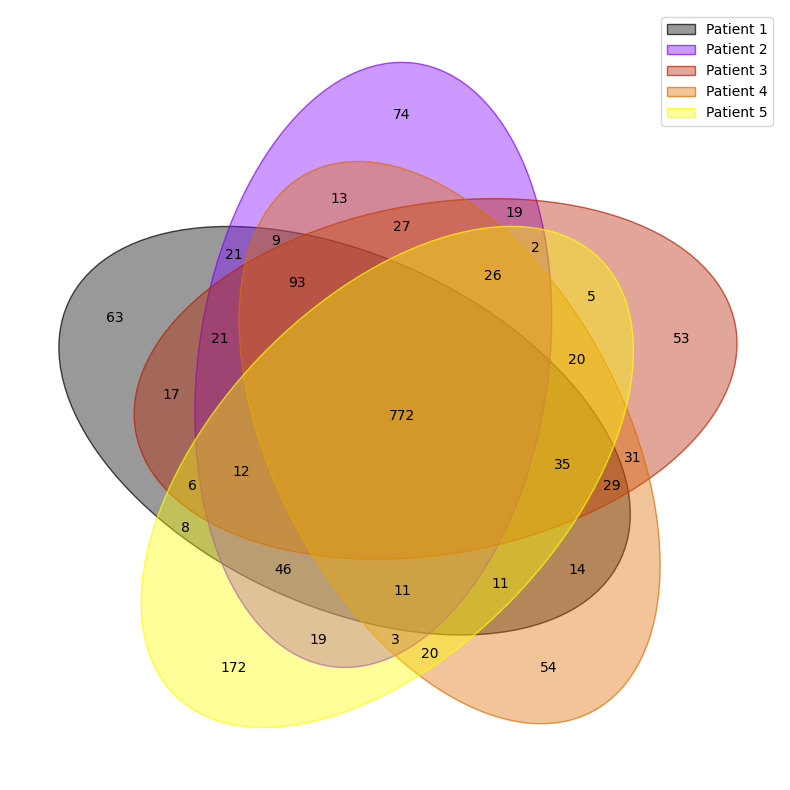
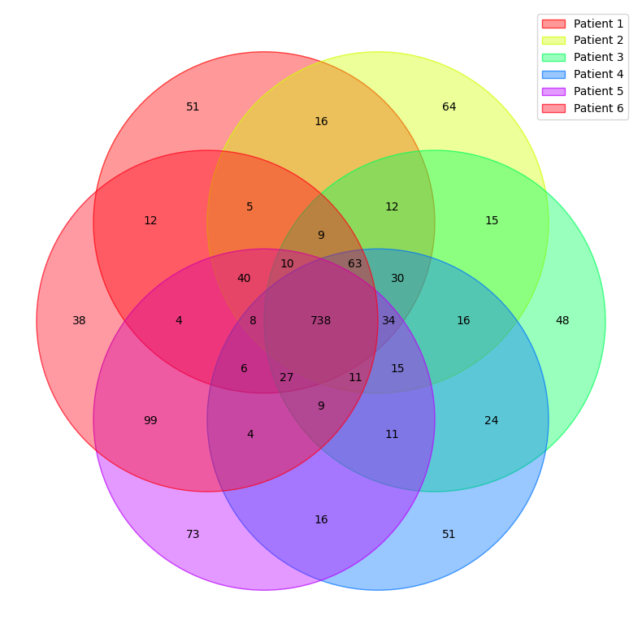

# ⭕ VennLit V2

**Application is accessible [HERE](https://labmaster.streamlit.app/)**

### ⚠ THE PROJECT HAS BEEN COMPILED IN [LABMASTER](https://github.com/Jumitti/labmaster)

A Venn diagram is a graphical representation of the relationships between different sets or groups of items. It is typically composed of overlapping circles, each representing a set, and the overlapping regions represent the elements that are common to those sets. The purpose of a Venn diagram is to visually illustrate the extent of overlap and the relationships between different sets of data. It is widely used in mathematics, logic, statistics, and various other fields to depict the intersections and differences between distinct categories or groups.

To tell the truth, I think that it is only by having fun and trying that you will know how to use the software. But here are some little tips.

# 📎 Example

You will find a demo of the software and also the **.csv** and **.xlsx** templates. 

💡 *For **.csv** files must be with **separators ";"***

You can download templates from [``example``](example) folder

# 💽 Upload data

This is where you can **upload** your **.csv** and **.xlsx** files. You can put **several** and even **mix** .csv and .xlsx.

This way you can **compare** lists from the first file with lists from the other files if you want.

⚠️*If several lists have the **same name**, then the software will **warn** you that you **cannot use** them. So be careful.*

# 🧮 Lists

It is just your list to quickly see it (why not?)

# 📌 Lists selection

You can select from **2 to 6** lists to make a **diagram**. Obviously, you can **mix** the lists of several .csv or .xlsx files

You can export data with **Download Venn Data** button.

⚠️*For obscure reasons (probably madness), you may want to compare **more than 6 lists**. Venn diagrams can't do that. But you can always select more than 6 lists and **export** the results. It's 'like' a Venn diagram but only with text (it's not pretty but bioinformaticians love it)*

# ⚙️ Diagram settings

## Number format:

- Number: display number of similitude
- Percentage: display percentage of similitude
- Logic: I think very few people will use this. This is a way of giving the **address of the observed section**. For example if you analyze 6 lists, the section common to all lists will be marked 111111. If the observed section does not have the 3rd list then it will be 11011

## Colors:

Ok, I had fun there. You have 38 different color panels. If you want exactly the colors of the panels, it's here:

[Choosing Colormaps — Matplotlib 3.8.2 documentation](https://matplotlib.org/stable/users/explain/colors/colormaps.html)

## Font size:

You can configure the font size, intuitive.

## Venn size:

Same but for the Venn diagram, intuitive.

## Legend position:

You can select the position of the legend between:

- Best: Thanks to a **neural network**, **deep learning** and necessarily **artificial intelligence**, I coded an **AI** which allows it to choose on its own where to **best place** the legend (that's not true, it's a function already implemented)
- Upper right
- Upper left
- Upper center
- Lower right
- Lower left
- Lower center
- Right
- Center right
- Center left
- Center

## Download .png and .svg

Simply, you can **download** the image in **png** format.

The **.svg** allows you to open the image with **[InkScape](https://inkscape.org/)** and other software to easily modify colors, fonts, etc.

 

# ❓Venn or Pseudo-Venn diagram for 6 comparisons

Six-set true Venn diagrams are somewhat unwieldy, and not all intersections are usually of interest.

Some intersections are not present, but the most commonly wanted are. You might want to order the input dictionary to ensure the instersections of interest show up on the diagram.

⚠️*You can uncheck **Hidden intersection** option if you wish to display information about elements in hidden intersections.*

# Credit

At first, it was to quickly sort my data. Then I wanted to have fun. I started working on it then I found [@dataprofessor](https://github.com/dataprofessor/vennlit)'s GitHub. So I joined the project. 
I added something new using [@LankyCyril](https://github.com/LankyCyril/pyvenn), a fork of [@tctianchi](https://github.com/tctianchi/pyvenn). And I also thank [InteractiVenn](http://www.interactivenn.net/) for inspiring me ([DOI](http://doi.org/10.1186/s12859-015-0611-3)).

If you encounter a problem, please send an email to [minniti@ipm.cnrs.fr](mailto:minniti@ipm.cnrs.fr) or [minnitijulien06@gmail.com](mailto:minnitijulien06@gmail.com) or use the [Issues](https://github.com/Jumitti/LabMaster/issues).
